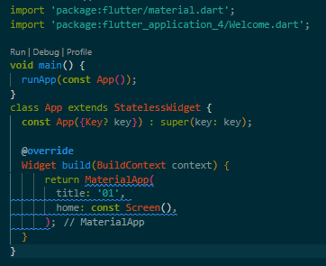
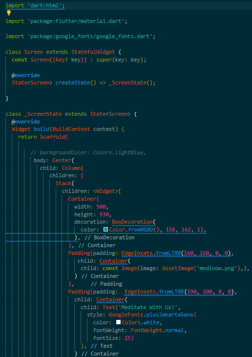
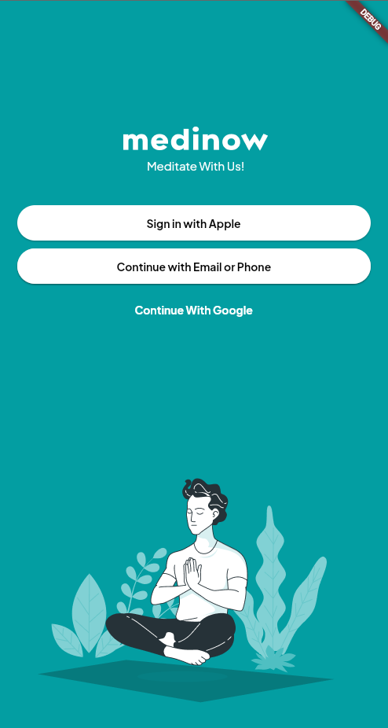
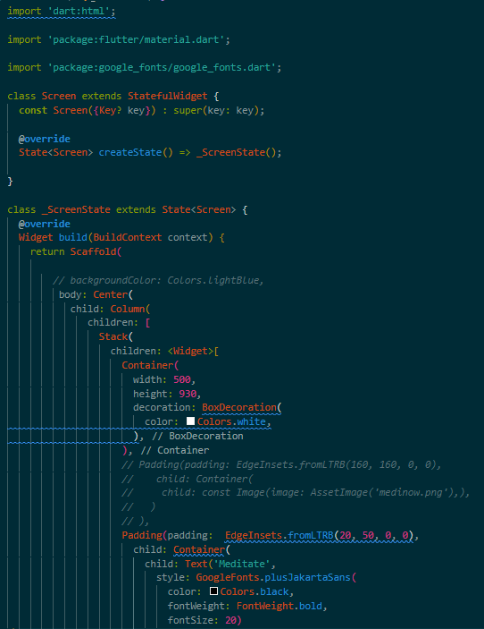
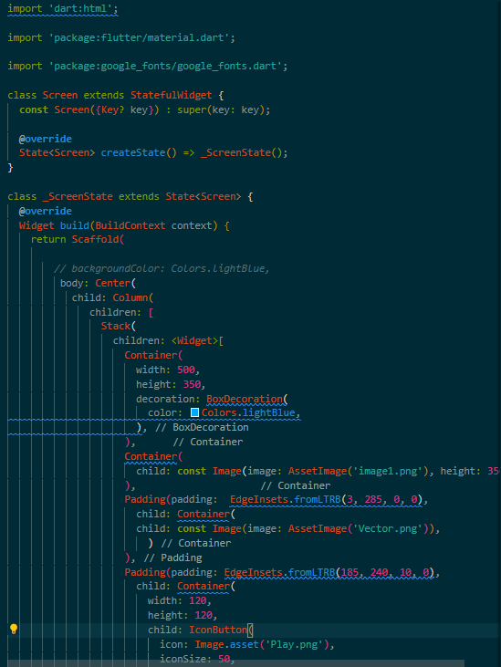
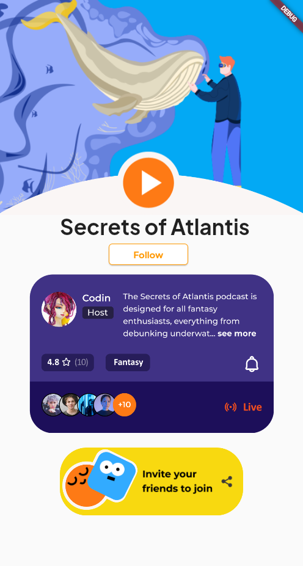

# Практическая работа №1
## Тема: Разработка макета.

#### Цель работы: сделать 3 макета оценка - 5, 2 макета оценка - 4, 1 макет оценка - 3.

#### Ход работы:

#### Данный код в классе main нужен для отображения верстки в классах Wellcom, Meditate, iPhone13mini.

#### Окно №1

#### В классе Wellcome я использовал контейнера для фона с цветом по RGB (3, 158, 162), также для кнопок был использован элемент TextButton в контенере с размером 200 на 45, и три кнопки. Картинку я экспортировал с сайта Figma в макете и вставил ее при помощи Image(image: AssetImage(''),).

#### Окно №2

#### В классе Meditate я использовал контейнер 500 на 930 белого цвета для фона, также использовал контейнер с текстом "Meditate" с шрифтом plusJakartSans, использовал IconButton для кнопки с изображением лупы. Все остальное было проделано по такому же принципу.

#### Окно №3

#### В классе iPhone13mini я использовал контейнер для верхнего фона с цветом light blue, также экспортировал картинку с сайта Figma в макете и наложил картинку на синий фон. Также для кнопок был использован элемент IconButton и TextButton в контенере.

#### Вывод: в данной практической работе были разработаны 3 окна по примеру из макета
