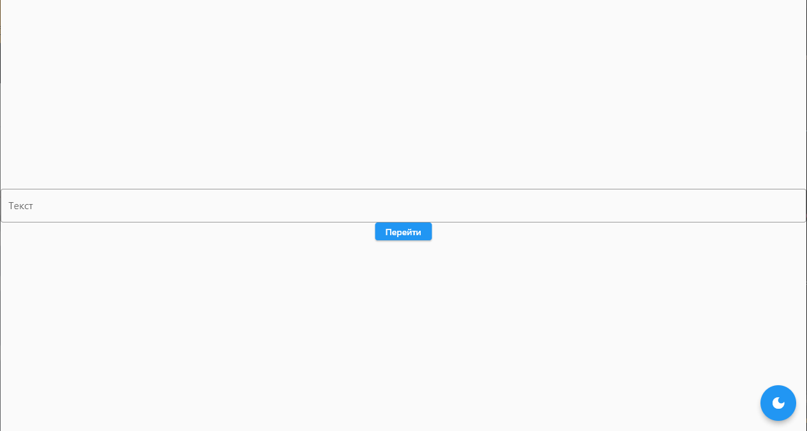
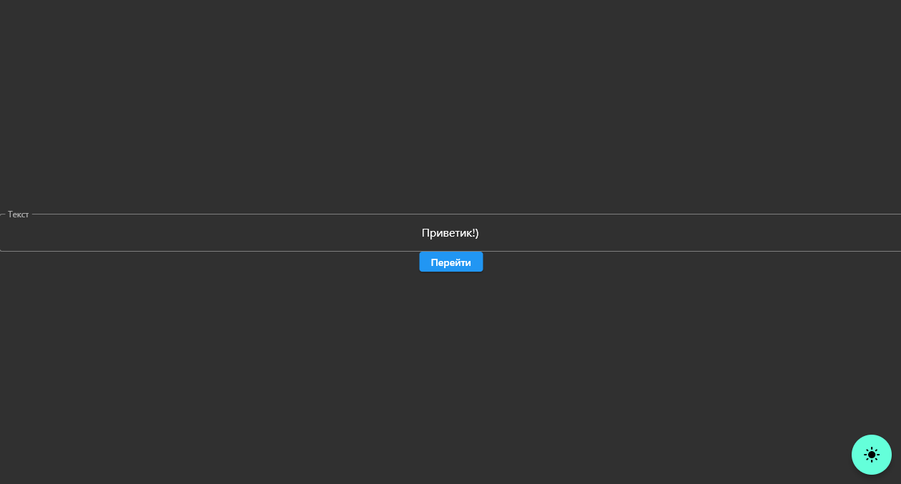
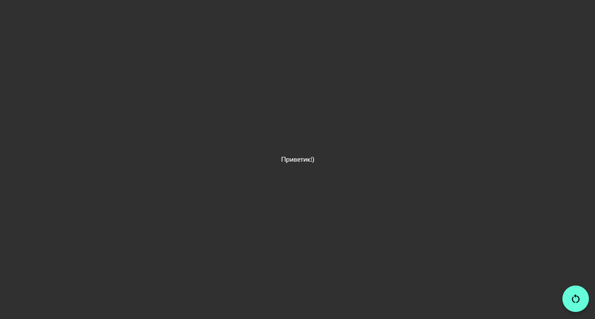

# Практическая работа №5
## Тема: Работа с SharedPreferences.

#### Цель работы: Реализовать восстановление данных после закрытия приложения. Если есть данные в SharedPreferences открыть 2 экран, если данных нет, то открыть 1 экран. Так же реализовать восстановление темы приложения.

#### Ход работы:

#### Работа программы

#### На 1 скриншоте показано открытие программы, по умолчанию со светлой темой.

#### На 2 скриншоте показано смена темы на темную.

#### На 3 скриншоте показан ввод текста в поле ввода, после чего нажатие на кнопку Перейти.

#### На 4 скриншоте показано смена окна и сохранение текста на втором окне при помощи SharedPreferences.

#### На 5 скриншоте показано сохранение данных после закрытия приложения.

#### Вывод: в ходе данной практической работы было произведено сохранение данных после перехода на следующее окно, а также сохранение данных после закрытия приложения, с использованием SharedPreferences.
