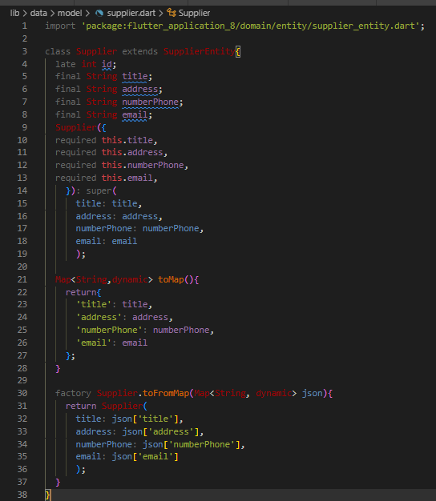
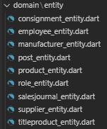

# Практическая работа №2

#### Тема: Реализация классов, отвечающих за работу базы данных

#### Цель работы: научиться реализовывать классы и модели.

#### Необходимо создать модель БД.

#### Необходимо скачать библиотеки, которые необходимы для работы с базой данных.

#### В папке common создадим файл data_base_request.

#### В папке model создадим модели БД:

#### Модели используемые в проекте:

#### В папке entity создаем сущности, пример сущности поставщика:

####  Сущности использумые в проекте:

#### В папках db создадим файл data_base_helper.

#### В этом файле будут хранится функции добавления, удаления, обновления базы.

#### - init - инициализация базы данных для всех платформ

#### - onUpdateTable - обновление таблиц

#### - onCreateTable - создание таблиц 

#### - onInitTable - заполнение таблиц данными

#### - onDropDataBase - удаление базы данных 

#### Демонстрация базы данных:

### Вывод: в ходе данной практической работы были реализованы классы, модели и сущности, отвечающие за работу БД для склада магазина автозапчастей.
