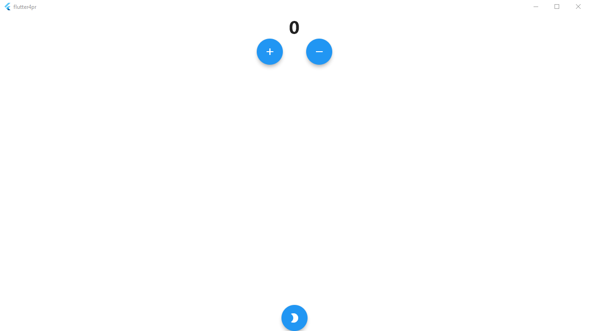

# ПРАКТИЧЕСКАЯ РАБОТА №3
### Реализация регистрации и авторизации пользователя

### Цель работы: реализовать регистрацию и авторизацию пользователя.

### Ход работы:
### Для начала работы с авторизацией и регистрации необходимо скачать следующие библиотеки:

### Рисунок 1 - библиотеки
### В папке core создаем папку usercase, здесь создаем файл auth
 
### Рисунок 2 - auth.dart
### В папке data создаем папку repository, здесь файл auth_repositories_impl
 
### Рисунок 3 - auth_repositories_impl.dart
### Далее необходимо изменить role_entity:
 
### Рисунок 4 - role_entity.dart
### В папке entity создаем папку usercases, здесь файл auth
 
### Рисунок 5 - auth.dart
### Далее создаем папку screens, в ней файлы, в которых будет верстка авторизации, регистрации и окон для админа с пользователем.
 
### Рисунок 6 – screens
 
### Рисунок 7 - окно регистрации с валидацией
 
### Рисунок 8 - окно авторизации с валидацией
 
### Рисунок 9 - окно админа

### Рисунок 10 - окно пользователя

### Рисунок 12 - пользователи в бд
 
### Вывод: в ходе данной практической работы была сделана авторизация и регистрация для пользователей.
