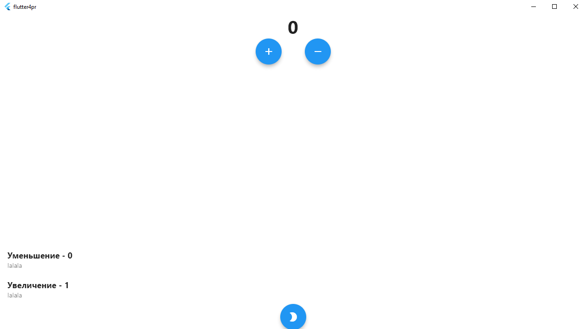

# Практическая работа №2

### Тема: Реализация классов, отвечающих за работу базы данных

### Цель работы: научиться реализовывать классы и модели.

### Ход работы:

### Для начала работы с базой данных необходимо создать даталогическую модель базы данных.

### Необходимо скачать библиотеки, которые нужны в работе с базой данных.

### В папке common создадим файл data_base_request.dart.

### В папке model создадим модели базы данных:

### Девять моделей:

### В папке entity создаем сущности:

###  Девять сущностей:

### В папках db создадим файл data_base_helper.dart.

### В этом файле будут хранится функции добавления, удаления, обновления базы.

### - init - инициализация базы данных для всех платформ

### - onUpdateTable - обновление таблиц

### - onCreateTable - создание таблиц 

### - onInitTable - заполнение таблиц данными

### - onDropDataBase - удаление базы данных 

### Демонстрация базы данных:

### Вывод: в данной практической работе были реализованы классы и модели, отвечающие за работу базы данных для склада.
